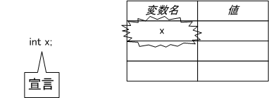
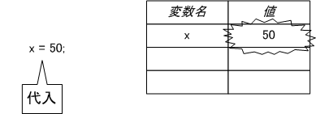
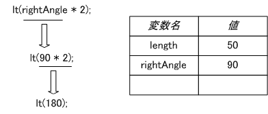

# コンピュータに情報を記憶させてみよう（変数）

## 学習目標
- 整数型の変数の作成（宣言），書き込み（代入），読み込み（評価と値）が使えるようになる
- 複数の変数（変数名による区別をしつつ）が使えるようになる
- 計算式（四則演算＋剰余計算）が使えるようになる
- ＣＵＩを使ってユーザ対話をするプログラムが作れるようになる

## 変数
今回新しく"変数"が登場します。家の大きさを変更できる次のプログラムをみてみましょう。

### 変数と値
次のプログラムを見てみましょう。

```{#lst:2-1 .javascript .numberLines caption="家を書くサンプルプログラム"}
var t = createTurtle(); //　タートルを生成する

var x; // 変数xを宣言する
x = 50; // 変数xに値50を代入する

{// 屋根を書く
    t.rt(30); // 30度右に回る
    t.fd(x); // x歩前に進む
    t.rt(120);
    t.fd(x);
    t.rt(120);
    t.fd(x);
}

{// 本体を書く
    t.lt(90);
    t.fd(x);
    t.lt(90);
    t.fd(x);
    t.lt(90);
    t.fd(x);
    t.lt(90);
    t.fd(x);
}
```

変数はデータを格納しておく場所のことです。 プログラムでは、「メモリ」の許す限り、データを格納しておくことが出来ます。

格納する場所を一つにつき、一つの名前をつけることが出来ます。

実際に格納されるデータのことを「値」といいます。


### 変数を使ったプログラムの実行
プログラムの実行過程と変数を見ていきましょう。

#. 変数の宣言
<br>
#. 変数へ値を代入する
<br>
#. 変数を評価して値にする
<br>

### 複数の変数と変数名
変数はいくつでも使うことが出来ます。

区別するために、変数には異なる名前をつけなければなりません。 異なる名前ならば好きな名前をつけることが出来ます。 空白や特殊記号が使えないのはクラス名と同じです。

#### 複数の変数と変数名
```{#lst:2-1 .javascript .numberLines caption="家を書くサンプルプログラム"}
var t = createTurtle(); //　タートルを生成する

var length;// 1辺の長さ
var rightAngle;// 直角

length = 50;// 1辺の長さを50に設定する
rightAngle = 90;// 直角を90度に設定する

{// 屋根を書く
    t.rt(30); // 30度右に回る
    t.fd(length); // x歩前に進む
    t.rt(120);
    t.fd(length);
    t.rt(120);
    t.fd(length);
}

{// 本体を書く
    t.lt(rightAngle);
    t.fd(length);
    t.lt(rightAngle);
    t.fd(length);
    t.lt(rightAngle);
    t.fd(length);
    t.lt(rightAngle);
    t.fd(length);
}
```

#### プログラムの実行過程
プログラムの実行過程を追ってみましょう。

#. 変数の宣言
<br>
#. 変数の宣言
<br>
#. 変数への値の代入
<br>
#. 変数への値の代入
<br>
#. 変数を評価して値にする


## コンピュータに計算をさせる
### 計算式を使ったプログラム

```{#lst:2-1 .javascript .numberLines caption="家を書くサンプルプログラム"}
var t = createTurtle(); //　タートルを生成する

var length = 100;// 1辺の長さ
var smallHouseLength;// 小さい家の1辺の長さ
var rightAngle = 90;// 直角
smallHouseLength = length / 2;

canvasSize(400,300);// Canvasのサイズを大きくする

{// 屋根を書く
    t.rt(30); // 30度右に回る
    t.fd(length); // x歩前に進む
    t.rt(120);
    t.fd(length);
    t.rt(120);
    t.fd(length);
}

{// 本体を書く
    t.lt(rightAngle);
    t.fd(length);
    t.lt(rightAngle);
    t.fd(length);
    t.lt(rightAngle);
    t.fd(length);
    t.lt(rightAngle);
    t.fd(length);
}

{// 小さい家を書く位置まで移動する
    t.up();
    t.lt(rightAngle * 2);
    t.fd(length * 2);
    t.lt(rightAngle);
    t.down();
}

{// 小さい家の屋根を書く
    t.rt(30);
    t.fd(smallHouseLength);
    t.rt(120);
    t.fd(smallHouseLength);
    t.rt(120);
    t.fd(smallHouseLength);
}

{ // 小さい家の本体を書く
    t.lt(rightAngle);
    t.fd(smallHouseLength);
    t.lt(rightAngle);
    t.fd(smallHouseLength);
    t.lt(rightAngle);
    t.fd(smallHouseLength);
    t.lt(rightAngle);
    t.fd(smallHouseLength);
}
```

コンピュータは計算機ですから、計算をさせることが出来ます。例えば、次のように書くと

`rightAngle * 2`
				
掛け算を行うことが出来ます。

このような、計算を行う書法のことを「式」といいます。

Javascriptで使うことが出来る基本的な計算命令を以下に示します。

`+`
:足し算をします

`-`
:引き算をします

`*`
:掛け算をします

`/`
:割り算をします

`%`
:割り算の余りを求めます

### 計算式を使ったプログラムの実行
次のように評価（計算）されて、具体的な値になり、プログラムが動きます。

#### 計算式と代入文を使ったプログラムの実行変数の宣言


計算式があっても、右辺から評価されるのは一緒です。

#### 変数の宣言


##考えてみよう {.unnumbered}
次のようなプログラムが動かない（コンパイルエラーとなる）のは何故ですか？考えてみましょう。

`length / 2  = smallHouseLength;`
				
## ユーザと対話する（インタラクティブ）なプログラム
### 入力を受け付ける
```{#lst:2-1 .javascript .numberLines caption="家を書くサンプルプログラム"}
var t = createTurtle(); //　タートルを生成する

var length;// 1辺の長さ
var rightAngle = 90;// 直角

length = input();// 1辺の長さを入力値に設定する

{// 屋根を書く
    t.rt(30); // 30度右に回る
    t.fd(length); // x歩前に進む
    t.rt(120);
    t.fd(length);
    t.rt(120);
    t.fd(length);
}

{// 本体を書く
    t.lt(rightAngle);
    t.fd(length);
    t.lt(rightAngle);
    t.fd(length);
    t.lt(rightAngle);
    t.fd(length);
    t.lt(rightAngle);
    t.fd(length);
}
```

ユーザにメッセージを出すには

`print("ここに出したいメッセージを書く")`
			
命令を使います。

出したいメッセージを「"」（ダブルクォーテーション）「"」（ダブルクォーテーション）で囲んでください。

## 乱数
### 命令ごとに毎回変わる値
```{#lst:2-1 .javascript .numberLines caption="家を書くサンプルプログラム"}
var t = createTurtle();// タートルを生成する

var length;// 1辺の長さ
var rightAngle = 90;// 直角

length = random(100);// 1辺の長さを0-99までのランダム値に設定する

{// 屋根を書く
    t.rt(30); // 30度右に回る
    t.fd(length); // x歩前に進む
    t.rt(120);
    t.fd(length);
    t.rt(120);
    t.fd(length);
}

{// 本体を書く
    t.lt(rightAngle);
    t.fd(length);
    t.lt(rightAngle);
    t.fd(length);
    t.lt(rightAngle);
    t.fd(length);
    t.lt(rightAngle);
    t.fd(length);
}
```

乱数値を（命令毎に毎回変わる値）に取得するには

`random(数)`
			
命令を使います。

実行されるごとに異なる値が自動的に選択されます。

「０」から「数の所に書いた数」未満のどれかの数字が選択されます。

（例：random(10)のとき、0から9までの１０種類のどれかの数が選択されます）

## 練習問題
### 与えられた大きさの正五角形を描くプログラム
ユーザの入力を受け取り、その長さを一辺の長さとして正五角形を描くプログラムを作ってください。

ファイル名は「pentagon2.js」とすること．

### 乱数を使って星を描くプログラム
長さに乱数を使い、実行するたびに大きさが変わる星を描くプログラムを作ってください。 乱数は50以上100未満の間になるようにすること。

ファイル名は「star2.js」とすること．