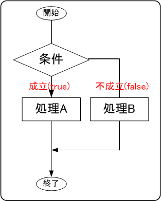
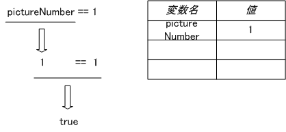
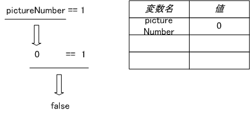
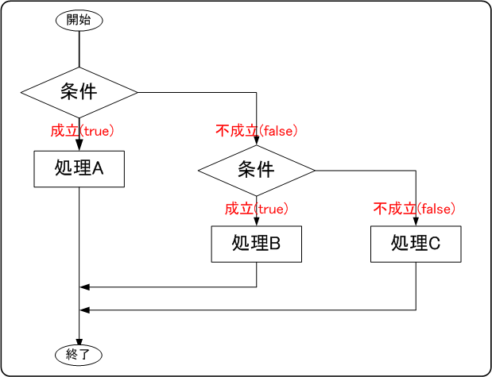
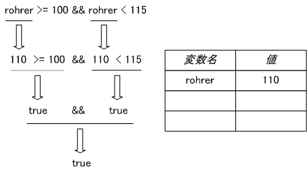
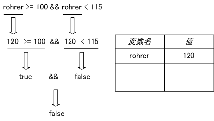

#プログラムに知性を(条件分岐)

## 学習目標
- 条件分岐のあるプログラムの実行順序を理解し、応用してプログラムが書けるようになる
- 比較演算子、論理演算子をつかって条件式を記述することができるようになる
- 変数の有効範囲について、ブロックという言葉を用いて説明できるようになる

## 条件分岐を使う
今回のテーマは条件に応じて動作が変化するプログラムを書くことです。

ユーザの入力に応じた絵を書かせてみましょう。

### 条件分岐
次のプログラムを見てみましょう。

```{#lst:3-1 .javascript .numberLines caption="Condition"}
var t = createTurtle();

var pictureNumber;// 絵の番号

{// ユーザから入力を受け取る
    pictureNumber = input("書きたい絵の番号を入力してください。(1.家, 2.星)");
}

if (pictureNumber == 1) {// 入力された番号が1ならば
    {// c//家を書く

        var length = 50;// 1辺の長さ
        var rightAngle = 90;// 直角

        {// 屋根を書く
            t.rt(30); // 30度右に回る
            t.fd(length); // x歩前に進む
            t.rt(120);
            t.fd(length);
            t.rt(120);
            t.fd(length);
        }

        {// 本体を書く
            t.lt(rightAngle);
            t.fd(length);
            t.lt(rightAngle);
            t.fd(length);
            t.lt(rightAngle);
            t.fd(length);
            t.lt(rightAngle);
            t.fd(length);
        }
    }

} else {// 入力された番号が1以外ならば
    {// c//星を書く

        var length = 100;// 1辺の長さ
        var angle = 144;// 星を書くときに曲がる角度

        {// 星を書く
            t.rt(18);
            t.fd(length);
            t.rt(angle);
            t.fd(length);
            t.rt(angle);
            t.fd(length);
            t.rt(angle);
            t.fd(length);
            t.rt(angle);
            t.fd(length);
        }
    }

}
```

いままでのプログラムでは、命令が必ず上から順番に全て実行されていました。 これを順次実行といいます。

今回登場する"条件分岐"を使うと、命令の実行される順番を変更、制御することができます。

条件分岐の一般的な形は次のとおりです。

```
if( [条件式] ) {
	処理A
} else {
	処理B
}
```
				
条件式が成立(true)のした場合には、処理Aが実行され、処理Bは実行されません。

逆に条件式が不成立(false)の場合には、処理Bが実行され、処理Aは実行されません。

これをフローチャートと呼ばれる図を用いて書くと、次のようになります。



ちなみに、elseブロックは必要が無ければ省略できます。次のような形になります。

```
if( [条件式] ) {
	処理A
}
```
				
このように書くと、条件式が成立した時に処理Aが実行され、不成立の時には処理Aを飛ばします。

### 条件式の評価
条件式の評価の過程を見ていきましょう。

1. 成立(true)する場合
<br>

1. 不成立(false)する場合
<br>

1. 注意すること
注意することは、条件式で、同じかどうか調べるには「==」(イコールを2つ)にしなければならないことです。

これに対して、「=」(イコール1つ)は代入ですので、注意してください。

### 複数の分岐
#### じゃんけんプログラム
複数に分岐するプログラムを書くこともできます。

次のじゃんけんプログラムを見てみましょう。

```{#lst:3-1 .javascript .numberLines caption="Janken"}
var t = createTurtle();

var handNumber;// じゃんけんの手

// じゃんけんの手は　1をグー,2をチョキ,3をパーとする
handNumber = random(3) + 1; // random(3)は0から2までの値を発生するので1を足す

if (handNumber == 1) {
    {// c//グーを書く
        t.fd(30);

        t.lt(30);
        t.fd(25);
        t.rt(60);
        t.fd(25);
        t.rt(150);
        t.fd(30);
        t.lt(180);
        t.fd(20);

        t.fd(20);
        t.rt(90);
        t.fd(20);
        t.rt(90);
        t.fd(20);
        t.lt(90);
        t.fd(5);

        t.lt(90);
        t.fd(20);
        t.rt(90);
        t.fd(20);
        t.rt(90);
        t.fd(20);
        t.lt(90);
        t.fd(5);

        t.lt(90);
        t.fd(20);
        t.rt(90);
        t.fd(20);
        t.rt(90);
        t.fd(20);
        t.lt(90);
        t.fd(5);

        t.lt(90);
        t.fd(20);
        t.rt(90);
        t.fd(20);
        t.rt(90);
        t.fd(20);

        t.fd(65);
    }

} else if (handNumber == 2) {
    {// c//チョキを書く

        t.fd(30);

        t.lt(30);
        t.fd(25);
        t.rt(60);
        t.fd(25);
        t.rt(150);
        t.fd(30);
        t.lt(180);
        t.fd(30);

        t.lt(15);
        t.fd(80);
        t.rt(105);
        t.fd(20);
        t.rt(75);
        t.fd(80);
        t.lt(75);

        t.lt(75);
        t.fd(80);
        t.rt(75);
        t.fd(20);
        t.rt(105);
        t.fd(80);
        t.fd(20);
        t.lt(105);
        t.fd(5);

        t.lt(90);
        t.fd(20);
        t.rt(90);
        t.fd(20);
        t.rt(90);
        t.fd(20);
        t.lt(90);
        t.fd(5);

        t.lt(90);
        t.fd(20);
        t.rt(90);
        t.fd(20);
        t.rt(90);
        t.fd(20);

        t.fd(65);
    }

} else if (handNumber == 3) {
    {// c//パーを書く

        t.fd(30);

        t.lt(30);
        t.fd(80);
        t.rt(120);
        t.fd(20);
        t.rt(60);
        t.fd(40);
        t.lt(150);
        t.fd(15);

        t.fd(80);
        t.rt(90);
        t.fd(20);
        t.rt(90);
        t.fd(80);
        t.lt(90);
        t.fd(5);

        t.lt(90);
        t.fd(80);
        t.rt(90);
        t.fd(20);
        t.rt(90);
        t.fd(80);
        t.lt(90);
        t.fd(5);

        t.lt(90);
        t.fd(80);
        t.rt(90);
        t.fd(20);
        t.rt(90);
        t.fd(80);
        t.lt(90);
        t.fd(5);

        t.lt(90);
        t.fd(80);
        t.rt(90);
        t.fd(20);
        t.rt(90);
        t.fd(80);

        t.fd(75);
    }

} else { // 1,2,3以外の場合

    println("不正な数です。");

}
```
#### じゃんけんの手のデータの扱いについて
じゃんけんプログラムのような現実問題を扱うときに問題となるのは、 データ（グー、チョキ、パーの手）をどうコンピュータで扱えるようにするかです。 コンピュータでは、そのままこの概念を表すことができないので、 ここでは、1,2,3の数値で表すという方法で実現することを考えましょう。


#### じゃんけんの手をどのようにプログラムのデータとして扱うか
このように、現実に即したプログラムを作成するためには、 データをコンピュータが扱う形式に変換するという作業が必要になります。 この作業のことをデータ構造の設計(モデル化)といいます。

### 複数の条件分岐
else if 文を使うと、複数にわたる条件分岐を記述することができます。

記述例(書式)を以下に示します。ちなみに、一つのif文に対して、else if文はいくつでも書くことができます。

```
if( [条件式] ) {
	処理A
} else if( [条件式] ) {
	処理B
} else{
	処理C
}
```
					
この場合のフローチャートは次のようになります。



## いろいろな条件式
### 比較演算子
次のプログラムを見てみましょう。

```{#lst:3-1 .javascript .numberLines caption="Rohrer"}
var height; // 身長
var weight; // 体重
var rohrer; // ローレル指数

{// ユーザの入力を受け取る
    height = input("身長を入力してください");
    weight = input("体重を入力してください");
}

{// ローレル指数を求める
    rohrer = weight * 10000000 / height / height / height;
    println("ローレル指数は" + rohrer + "です。");
}

{// 体型に対するコメントを提示する
    if (rohrer < 100) {
        println("やせすぎですね。");
    } else if (rohrer < 115) {
        println("やせていますね。");
    } else if (rohrer < 145) {
        println("普通ですね。");
    } else if (rohrer < 160) {
        println("太っていますね。");
    } else {
        println("太りすぎですね。");
    }
}
```

今度のプログラムでは、ローレル指数の範囲に対応して、メッセージが変わっていますね。 このように、プログラムでは、変数に入っている値が同じかどうかを調べるだけでなく、 大きさの大小を比較して、条件を判定することもできます。

表. Javascriptで使える数値の比較演算子

|演算子	|表記例	|評価|
|:---:|:---:|---:|
|==	|A==B	|AとBが同じ値の時成立(true)|
|!=	|A!=B	|AとBが同じ値でない時成立(true)|
|>	|A>B	|AがBより大きい時成立(true)|
|<	|A<B	|AがBより小さい時成立(true)|
|>=	|A>=B	|AがB以上の時成立(true)|
|<=	|A<=B	|AがB以下の時成立(true)|

### 論理演算子
次のプログラムを見てみましょう。

#### Rohrer2
```{#lst:3-1 .javascript .numberLines caption="Rohrer2"}
var height; // 身長
var weight; // 体重
var rohrer; // ローレル指数

{// ユーザの入力を受け取る
    height = input("身長を入力してください");
    weight = input("体重を入力してください");
}

{// ローレル指数を求める
    rohrer = weight * 10000000 / height / height / height;
    println("ローレル指数は" + rohrer + "です。");
}

{// 体型に対するコメントを提示する
    if (rohrer < 100) {
        println("やせすぎですね。");
    }
    if (rohrer >= 100 && rohrer < 115) {
        println("やせていますね。");
    }
    if (rohrer >= 115 && rohrer < 145) {
        println("普通ですね。");
    }
    if (rohrer >= 145 && rohrer < 160) {
        println("太っていますね。");
    }
    if (rohrer >= 160) {
        println("太りすぎですね。");
    }
}
```

今度のプログラムも、前例とやっていることは同じなのですが、条件文がちょっと異なっていますね。

論理演算子を使うと、2つの条件式を使って、それらの条件が両方とも(And)もしくは、 どちらか(Or)が成立した時のように、組み合わされた条件式全体の条件を判定することができます。

表 Javascriptで使える論理演算子

|演算子	|表記例	|意味
|:---:|:---:|---:|
|`&&`	|A&&B	|AとB両方ともtrueの時true
|`||`	|A||B	|AもしくはBがtrueの時true

#### 論理演算子の評価の過程
論理演算子の評価の過程を見ていきましょう。

1. And演算子が成立(true)する場合
<br>
2. And演算子が不成立(false)する場合
<br>

## 変数のスコープ（有効範囲）
変数には有効範囲（スコープといいます）があります．Javascriptでは基本的に，宣言した変数のブロック内(「{}」で囲まれた範囲)がスコープになります．

例えば、次のような例の場合の各変数のスコープは下表のようになります。

```
var z;
	
if( [条件式] ) {

	var x;
	処理A
	
} else {

	var y;
	処理B
	
}
```
				
表. 変数のスコープ

|変数名	|処理A	|処理B|
|:---:|---:|---:|
|x	|有効	|無効
|y	|無効	|有効
|z	|有効	|有効

スコープ外で変数を呼び出そうとすると、エラーが出ます。

スコープ外なら同じ変数名を使うことができます。 その場合、それぞれの変数が違う値を持つことになります。

## 練習問題
### 絵の描き分けプログラムを作ろう
前回作ったプログラムを改造して、条件式を使って、 ユーザの入力に応じて、タートルの書く絵を変えるプログラムを書いてください。 余裕がある人は、条件文を駆使して実用的なプログラムに挑戦してみてください。

ファイル名は「figureshop.js」とすること．

### おみくじプログラムを作ろう
乱数と条件分岐を使って、「大吉」「中吉」「小吉」「凶」を表示するプログラムを作りましょう。 大吉のときだけ、タートルの絵（星など）を描くようにしましょう。

ファイル名は「omikuji.js」とすること．

### 評点グレード変換プログラムを作ろう
入力と条件分岐を使って、「秀」「優」「良」「可」「不可」を表示するプログラムを作りましょう。 ユーザが評点を入力すると、それに応じたグレードが表示されるようにプログラムを書いてください。 評点区分とグレードの定義は静大の評価制度を利用すること。

ファイル名は「grade.js」とすること．

