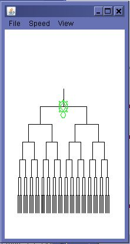
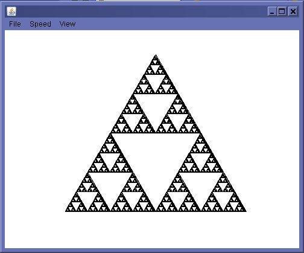
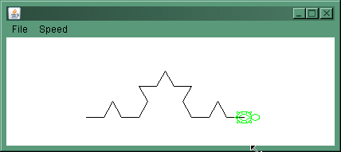

# 挑戦：再帰プログラム

## 学習目標
- 関数の再帰呼出しとその実行過程を理解する
- 再帰プログラム，再帰構造の美しさを楽しむ

## 再帰呼び出し
### あらまし
関数が自分自身を呼び出す処理を，再帰関数呼び出しと言う・(実は自分自身を呼び出すように見えて，もう一つのコピーを呼び出しているだけなのですがね．)

関数の再帰呼び出しを使うことで，いろいろな面白いプログラムが書ける．

### 階乗計算
数学で使う概念の一つに階乗がある．

nの階乗は１からnまでの数を掛け合わせたもので，n!と書く．次に例を示す．

```
2! = 2 * 1 = 2
3! = 3 * 2 * 1 = 6
4! = 4 * 3 * 2 * 1 = 12
```
nの階乗は以下の式で求められる．

```
n! = n * (n-1)!
```

つまり，n-1の階乗が求められれば，それにnをかけることでnの階乗が求められる．

この式を応用し，再帰を使うことで，階乗を求めるプログラムを次のように書ける．

<!-- リスト 14.2.2.1 Factorial.js -->
```{#lst:7-1 .javascript .numberLines caption="House"}
println("factorial(1) = " + factorial(1));
println("factorial(2) = " + factorial(2));
println("factorial(3) = " + factorial(3));
println("factorial(4) = " + factorial(4));
println("factorial(5) = " + factorial(5));

function factorial(n) {
    var result;
    if (n == 1) {
        result = 1;
    } else {
        result = n * factorial(n - 1);
    }
    return result;
}
```
 
###再帰の終点{.unnumbered}
上記の例ではfactorial()関数からfactorial()関数を呼んでいるので，再帰の終点を作ってやらないと呼出しが無限に続いて，プログラムが止まらなくなる． （実際には，呼び出すごとに関数がスタックと呼ばれるメモリに読み込まれるので，そのメモリがいっぱいになってStackOverFlowErrorというエラーを出して止まる．

したがって，どこかで止めるプログラムを書かなければならない．上記の例では，

```						
if (n == 1) {
	result = 1;
}
```
					
の部分がそれにあたる．

再帰のプログラムは関数の中で自分自身の関数を呼び出しているのが特徴だが，自分自身に見えるけれども実は新たなコピーを作り，呼び出しているだけである．

このコピーの様子を視覚化して理解するために，呼出し過程を図示してみよう．

<!-- リスト 14.2.2.2 FactorialWithPrint.js -->
```{#lst:7-1 .javascript .numberLines caption="House"}
print("factorial(5, 0) = " + factorial(5, 0));

function factorial(n, indentCount) {
    printStart(n, indentCount);
    var result;
    if (n == 1) {
        result = 1;
    } else {
        result = n * factorial(n - 1, indentCount + 1);
    }
    printEnd(result, indentCount);
    return result;
}

function printStart(length, indentCount) {
    makeIndent(indentCount);
    println("factorial(" + length + ", " + indentCount + ")");
}

function printEnd(result, indentCount) {
    makeIndent(indentCount);
    println("// return " + result);
}

function makeIndent(indentCount) {
    for (var i = 0; i < indentCount; i++) {
        print("\t");
    }
}
```					
factorial(5, 0)
	factorial(4, 1)
		factorial(3, 2)
			factorial(2, 3)
				factorial(1, 4)
				// return 1
			// return 2
		// return 6
	// return 24
// return 120			
```		

異なる引数で関数が呼ばれているだけということが分かったと思う．

（ちなみに，階乗の計算は総和と同じように繰り返しでも書ける．）

### フィボナッチ数列
フィボナッチ数列という数列がある．これも文系の諸君にはあまりなじみがないかもしれないが， 自然界によくみられる不思議な数列である．（このサイトなどをみてみよう）

fib(n)は次の式で求められる．

```
fib(n) = fib(n-1) + fib(n-2)
```

以下が具体例である．
```
fib(1) = 1
fib(2) = 2
fib(3) = fib(2) + fib(1) = 3
fib(4) = fib(3) + fib(2) = 5
fib(5) = fib(4) + fib(3) = 8
fib(6) = fib(5) + fib(4) = 13
```
フィボナッチ数列も再帰の例でよく出てくる例で，再帰を使うことでプログラムを次のように書ける．

<!-- リスト 14.2.3.1 Fibonacci.js -->
```{#lst:7-1 .javascript .numberLines caption="House"}
println("fib(1) = " + fib(1));
println("fib(2) = " + fib(2));
println("fib(3) = " + fib(3));
println("fib(4) = " + fib(4));
println("fib(5) = " + fib(5));
println("fib(6) = " + fib(6));
println("fib(7) = " + fib(7));

function fib(n) {
    var value;
    if (n == 1) {
        value = 1;
    } else if (n == 2) {
        value = 2;
    } else {
        value = fib(n - 1) + fib(n - 2);
    }
    return value;
}
```

これも呼出し過程を図示してみよう

<!-- リスト 14.2.3.2 FibonacciWithPrint.js -->
```{#lst:7-1 .javascript .numberLines caption="House"}
print("fib(5, 0) = " + fib(5, 0));

function fib(n, indentCount) {
    printStart(n, indentCount);
    var value;
    if (n == 1) {
        value = 1;
    } else if (n == 2) {
        value = 2;
    } else {
        value = fib(n - 1, indentCount + 1) + fib(n - 2, indentCount + 1);
    }
    printEnd(value, indentCount);
    return value;
}

function printStart(length, indentCount) {
    makeIndent(indentCount);
    println("fib(" + length + ", " + indentCount + ")");
}

function printEnd(result, indentCount) {
    makeIndent(indentCount);
    println("// return " + result);
}

function makeIndent(indentCount) {
    for (i = 0; i < indentCount; i++) {
        print("\t");
    }
}
```

```			
fib(5, 0)
	fib(4, 1)
		fib(3, 2)
			fib(2, 3)
			// return 2
			fib(1, 3)
			// return 1
		// return 3
		fib(2, 2)
		// return 2
	// return 5
	fib(3, 1)
		fib(2, 2)
		// return 2
		fib(1, 2)
		// return 1
	// return 3
// return 8			
```

### 再帰とプログラムの効率{.unnumbered}
最後の例の呼出し過程をよく見るとfib(1)とかfib(2)は何回も呼ばれており，大変効率が悪いプログラムである．

再帰プログラムでは，プログラムが計算式と似たように，わかりやすく書ける代わりに，効率が悪くなることがある．（絶対にそうなるわけではない）

上記のフィボナッチ数列のプログラムは，fib(20)くらいまでは動作するが，fib(50)ではコンピュータはお手上げ状態のはず（計算が終わらない）はずである．試してみよう． 実は，現実には，フィボナッチ数列は，「再帰を使ってはいけない例」として有名である．

## フラクタル図形
フラクタル図形は簡単に言えば「どんなに拡大しても複雑な図形」のことをさす・(wikipedia 2011)

フラクタル図形の一種である自己相似図形は，自分自身と同じ形のミニチュアが自分の中に入れ子になっている図形をさす．

自己相似図形と再帰プログラムには深い関係があり，再帰プログラムを使ってフラクタル図形を書くことができる．

このような図形を書くには，まず繰り返される基本的な図形と変換ルールを考える．この場合は以下のように「Y」に小さな「Y」を足していく プログラムを考える．


まず，「Y」を描くプログラムを書く．ここで一回テストしてみることが重要である． （いきなり再帰のプログラム書こうとした先輩は，ことごとく失敗しています！）

リスト 14.3.1 DrawY.js
```{#lst:7-1 .javascript .numberLines caption="House"}
var t = createTurtle();
canvasSize(500,500);
t.warp(250,400);

drawY(50);

function drawY(length) {
  
  t.fd(length);// 幹を描く
  
  // 左の枝を描く
  t.lt(30);
  t.fd(length / 2);
  t.bk(length / 2);
  t.rt(30);
  
  // 右の枝を描く
  t.rt(30);
  t.fd(length / 2);
  t.bk(length / 2);
  t.lt(30);
  
  t.bk(length);// 幹の根元に戻る
  
}
```

次に，大きな「Y」の先に小さな「Y」を書くように，再帰呼び出しを行う．再帰の終点も忘れずに！

<!-- リスト 14.3.2 DrawTree.js -->
```{#lst:7-1 .javascript .numberLines caption="House"}
var t = createTurtle();
canvasSize(500,500);
t.warp(250,400);

drawY(50);

function drawY(length) {
  
  if (length < 5) {// 再帰の終点
    return;
  }
  
  t.fd(length);// 幹を描く
  
  // 左の枝を描く
  t.lt(30);
  t.fd(length / 2);
  drawY(length / 2);
  t.bk(length / 2);
  t.rt(30);
  
  // 右の枝を描く
  t.rt(30);
  t.fd(length / 2);
  drawY(length / 2);
  t.bk(length / 2);
  t.lt(30);
  
  t.bk(length);// 幹の根元に戻る
  
}
```

<!-- このプログラムの関数の呼出し過程を表示すると，次のようになる．

リスト 14.3.3 DrawTreeWithPrint.js
					
drawY(50, 0)
	drawY(25, 1)
		drawY(12, 2)
			drawY(6, 3)
				drawY(3, 4)
				//
				drawY(3, 4)
				//
			//
			drawY(6, 3)
				drawY(3, 4)
				//
				drawY(3, 4)
				//
			//
		//
		drawY(12, 2)
			drawY(6, 3)
				drawY(3, 4)
				//
				drawY(3, 4)
				//
			//
			drawY(6, 3)
				drawY(3, 4)
				//
				drawY(3, 4)
				//
			//
		//
	//
	drawY(25, 1)
		drawY(12, 2)
			drawY(6, 3)
				drawY(3, 4)
				//
				drawY(3, 4)
				//
			//
			drawY(6, 3)
				drawY(3, 4)
				//
				drawY(3, 4)
				//
			//
		//
		drawY(12, 2)
			drawY(6, 3)
				drawY(3, 4)
				//
				drawY(3, 4)
				//
			//
			drawY(6, 3)
				drawY(3, 4)
				//
				drawY(3, 4)
				//
			//
		//
	//
//			
（呼び出し過程もフラクタル図形になっているところが印象的である．） -->

## 練習問題
### 自然な木を描こう
木を描くサンプルプログラムを改造して，自然な木を描くプログラムにしよう・

【自然な木に見せるためのヒント】

- 小さい枝の生える角度と長さを乱数を使って決めるようにする・
- 角度は-45度から45度の間にする・
- 長さは元の枝の長さの0.6から0.9倍くらいの長さにする・
- 枝から生える枝の数を，2本から3本にする．

ファイル名は「naturaltree.js」とすること．

<!-- 図 14.4.1.1 cooltree -->


### トーナメント表を描いてみよう
関数の再帰呼出しを応用して，下記の図を書いてみましょう．



ファイル名は「tournament.js」とすること．

### ギャスケットを描いてみよう
関数の再帰呼出しを応用して，下記の図を書いてみましょう．



ファイル名は「gasket.js」とすること．

### スーパースターを描いてみよう
関数の再帰呼出しを応用して，下記の図を書いてみましょう．


ファイル名は「superstar.js」とすること．

### コッホ曲線を描いてみよう
関数の再帰呼出しを応用して，下記の図を書いてみましょう．



ファイル名は「koch.js」とすること．

<!-- ### ひまわりの絵を描こう
このサイトを参考にして，ひまわりの絵を描いてみましょう．

ファイル名は「Sunflower.js」とすること．

### 葉っぱの絵を描こう
このサイトを参考にして，葉っぱの絵を描いてみましょう．

ファイル名は「Leaf.js」とすること． -->

