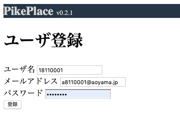
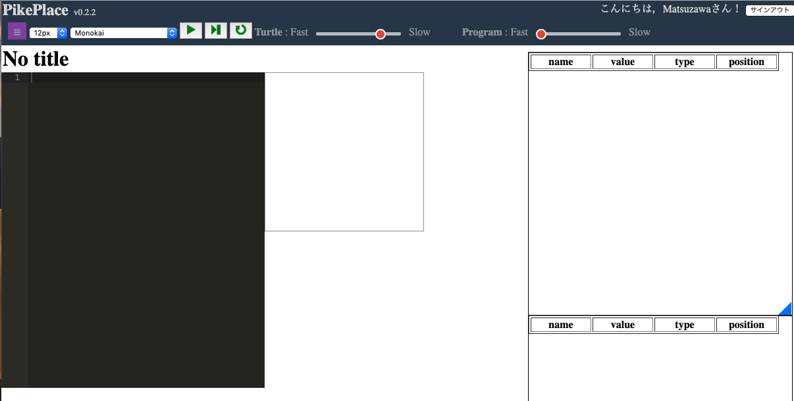
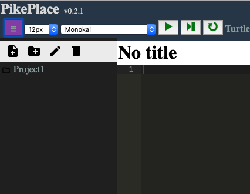
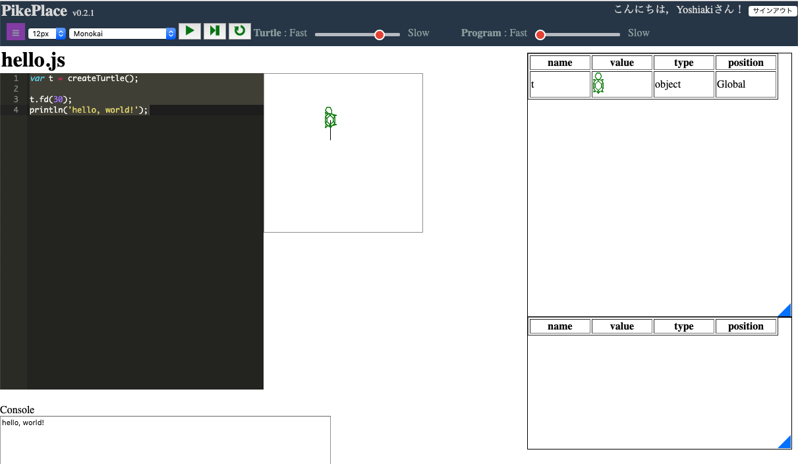

# 開発環境(sumatra)の説明

第５週目までは，初学者用Javascript開発環境(pikeplace - sumatra)を使って学習を進めます．
ここでは，簡単に使い方を説明します．

## ブラウザ
ブラウザはChromeを使用してください．Chrome以外のブラウザでも動作する可能性はありますが，テストはしておりません．

## ユーザ登録
ユーザ登録の必要はありません．GSuiteアカウントを使って認証してください．

<!--  -->
<!-- 初回はユーザ登録が必要です．ユーザ名は学生番号（半角で！），メールアドレスは青山メールを，パスワードは任意のものを入力してください．ユーザ名（学生番号）が間違っていると，採点されない可能性がありますので注意ください． -->

## 起動時の画面

ユーザ認証を済ませると，以下のような画面が起動します．

## ファイルの作成

それでは，はじめのプログラムのためのファイルを作ってみましょう．

左上の

ボタンをクリックし，ファイルツリーを開きます（下図）

Project1フォルダは最初から作られています．
ファイルツリービューの操作アイコンとして，左から，

- ファイルの作成: 
- プロジェクトの作成: 
- ファイル名の編集: 
- ファイルの削除: 

ボタンが表示されています．

Project1フォルダは最初から作られていますので，その「Project1」フォルダを選択し，ファイルの作成アイコンを押すことで，「hello.js」という名前のファイルを作成してみましょう．

## プログラムの作成，実行

「hello.js」ファイルができたら，もう一度ファイルツリーボタンを押してファイルツリーを消し，プログラムを書いてみましょう．（コピペできませんので，打ち込んでください．）

プログラムの内容は後から勉強していただくとして，プログラムができたら，
ボタンを押し，実行してみましょう．右の画面に亀が表示され３０歩進むアニメーションが表示され，consoleにhello, world!という文字がでが出現したら成功です．右側に変数が表示されています．

## プログラムのステップ実行

プログラムを全部実行するるのではなくて，１行ずつ実行することもできます．
ボタンを１回押してリセットをした後，ボタンを押すごとに，１行ずつステップ実行することができます．

## プログラムの保存

プログラムは，実行するたびに自動的に保存されます．保存だけしたい場合はリロードボタンを押下してください．

## そのほか
### アニメーションの速度調整
 - Turtleゲージでタートルグラフィックスのアニメーションの速度が変更できます．
 - Programゲージで変数表示アニメーションの速度を変更できます．

### ソースエディタ
 - ソースエディタのフォントの変更ができます．
 - Ctrl-s　でソースコードの整形ができます．

