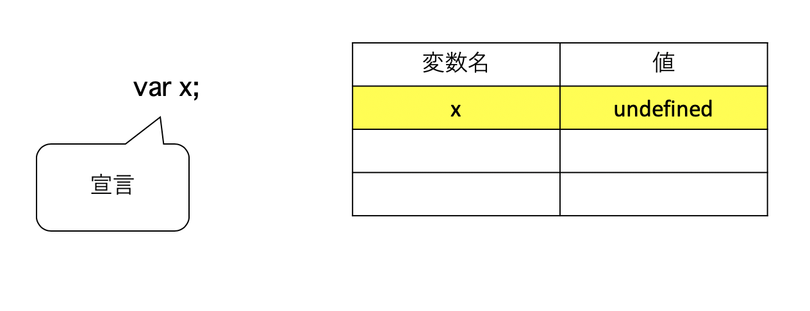
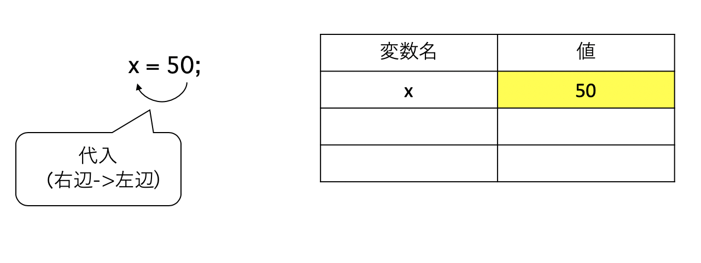
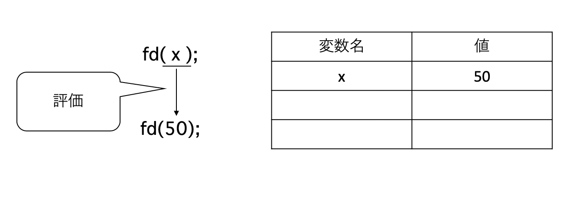
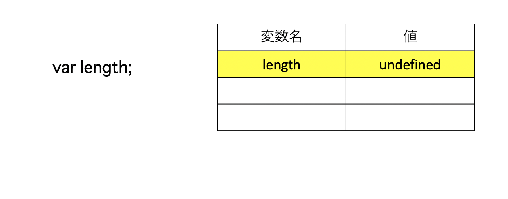
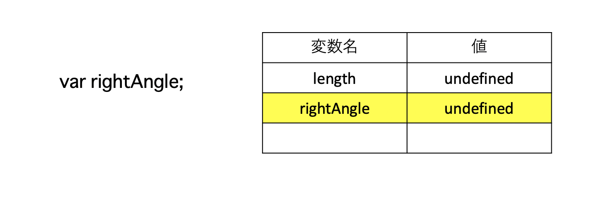
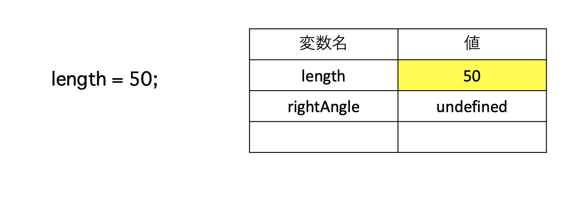
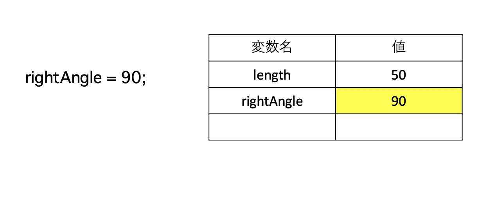
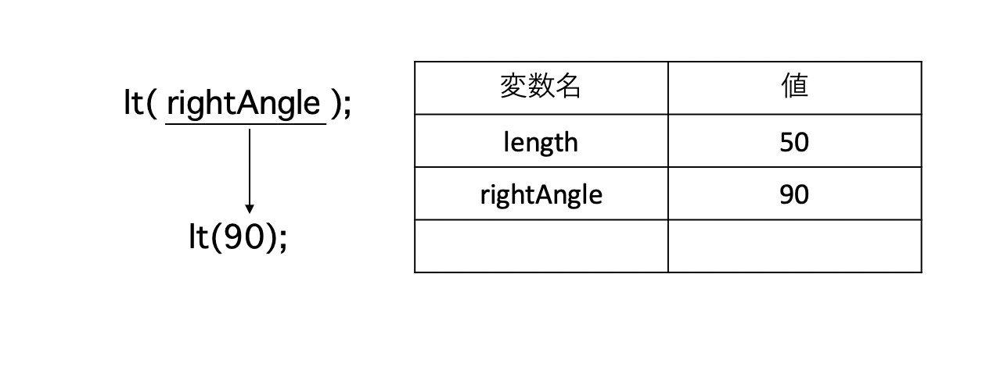
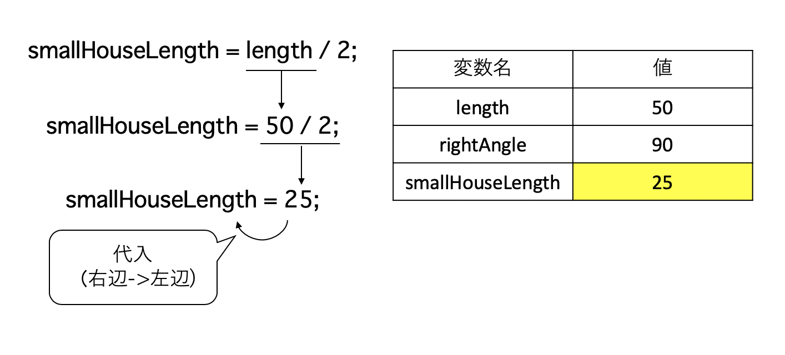

# コンピュータに情報を記憶させてみよう（変数）

## 学習目標
- 変数の作成（宣言），書き込み（代入），読み込み（評価と値）が使えるようになる
- 複数の変数（変数名による区別をしつつ）が使えるようになる
- 計算式（四則演算＋剰余計算）が使えるようになる
<!-- - ＣＵＩを使ってユーザ対話をするプログラムが作れるようになる -->

## 変数
今回新しく"変数"が登場します．家の大きさを変更できる次のプログラムをみてみましょう．
次のプログラムを見てみましょう．

```{#lst:2-1 .javascript .numberLines caption="家を書くサンプルプログラム"}
var t = createTurtle(); //　タートルを生成する

var x; // 変数xを宣言する
x = 50; // 変数xに値50を代入する

{// 屋根を書く
    t.rt(30); // 30度右に回る
    t.fd(x); // x歩前に進む
    t.rt(120);
    t.fd(x);
    t.rt(120);
    t.fd(x);
}

{// 本体を書く
    t.lt(90);
    t.fd(x);
    t.lt(90);
    t.fd(x);
    t.lt(90);
    t.fd(x);
    t.lt(90);
    t.fd(x);
}
```
### ブロック
「屋根を書く」，「本体を書く」のように，中括弧で囲まれた部分をブロックと呼びます．プログラムは複数のブロックから構成されます．ブロックの中にブロックを入れる（入れ子にする）ことも出来ます．

上記のプログラムの２つのブロックは，空ブロックといって，プログラムとしては必要はないのですが（実際に取り払ってもプログラムは動きます），人間がプログラムのまとまりを把握しやすいようにブロックを記述しています．カッコの対応があっていないと，構文エラーになりますので注意してください．

### 変数と値
変数はデータを格納しておく場所のことです． プログラムでは，「メモリ」の許す限り，データを格納しておくことが出来ます．

格納する場所を一つにつき，一つの名前をつけることが出来ます．

実際に格納されるデータのことを「値」といいます．


### 変数を使ったプログラムの実行
プログラムの実行過程と変数を見ていきましょう．

1. 変数の宣言
<div class="CJPicture">
<br>
</div>

1. 変数へ値を代入する
<div class="CJPicture">
<br>
</div>

1. 変数を評価して値にする
<div class="CJPicture">
<br>
</div>

### 複数の変数と変数名
変数はいくつでも使うことが出来ます．

区別するために，変数には異なる名前をつけなければなりません．異なる名前ならば基本的には好きな名前をつけることが出来ます．ただし，次のような名前は使えません．

- 数字から始まる名前 (01XXなど)
- 予約語 (var, for, ifなど，プログラムで使用する名前)
- 特殊記号は アンダーバー(_), ドル（$）が使用可能，それ以外はNG

#### 複数の変数と変数名
```{#lst:2-1 .javascript .numberLines caption="家を書くサンプルプログラム"}
var t = createTurtle(); //　タートルを生成する

var length;// 1辺の長さ
var rightAngle;// 直角

length = 50;// 1辺の長さを50に設定する
rightAngle = 90;// 直角を90度に設定する

{// 屋根を書く
    t.rt(30); // 30度右に回る
    t.fd(length); // x歩前に進む
    t.rt(120);
    t.fd(length);
    t.rt(120);
    t.fd(length);
}

{// 本体を書く
    t.lt(rightAngle);
    t.fd(length);
    t.lt(rightAngle);
    t.fd(length);
    t.lt(rightAngle);
    t.fd(length);
    t.lt(rightAngle);
    t.fd(length);
}
```

#### プログラムの実行過程
プログラムの実行過程を追ってみましょう．

1. 変数の宣言
<div class="CJPicture">
<br>
</div>

1. 変数の宣言
<div class="CJPicture">
<br>
</div>

1. 変数への値の代入
<div class="CJPicture">
<br>
</div>

1. 変数への値の代入
<div class="CJPicture">
<br>
</div>

1. 変数を評価して値にする
<div class="CJPicture">
<br>
</div>

## コンピュータに計算をさせる
### 計算式を使ったプログラム

```{#lst:2-1 .javascript .numberLines caption="家を書くサンプルプログラム"}
var t = createTurtle(); //　タートルを生成する

var length = 100;// 1辺の長さ
var smallHouseLength;// 小さい家の1辺の長さ
var rightAngle = 90;// 直角
smallHouseLength = length / 2;

canvasSize(400,300);// Canvasのサイズを大きくする

{// 屋根を書く
    t.rt(30); // 30度右に回る
    t.fd(length); // x歩前に進む
    t.rt(120);
    t.fd(length);
    t.rt(120);
    t.fd(length);
}

{// 本体を書く
    t.lt(rightAngle);
    t.fd(length);
    t.lt(rightAngle);
    t.fd(length);
    t.lt(rightAngle);
    t.fd(length);
    t.lt(rightAngle);
    t.fd(length);
}

{// 小さい家を書く位置まで移動する
    t.up();
    t.lt(rightAngle * 2);
    t.fd(length * 2);
    t.lt(rightAngle);
    t.down();
}

{// 小さい家の屋根を書く
    t.rt(30);
    t.fd(smallHouseLength);
    t.rt(120);
    t.fd(smallHouseLength);
    t.rt(120);
    t.fd(smallHouseLength);
}

{ // 小さい家の本体を書く
    t.lt(rightAngle);
    t.fd(smallHouseLength);
    t.lt(rightAngle);
    t.fd(smallHouseLength);
    t.lt(rightAngle);
    t.fd(smallHouseLength);
    t.lt(rightAngle);
    t.fd(smallHouseLength);
}
```

コンピュータは計算機ですから，計算をさせることが出来ます．例えば，次のように書くと

`rightAngle * 2`
				
掛け算を行うことが出来ます．

このような，計算を行う書法のことを「式」といいます．

Javascriptで使うことが出来る基本的な計算命令を以下に示します．

`+`
:足し算をします

`-`
:引き算をします

`*`
:掛け算をします

`/`
:割り算をします

`%`
:割り算の余りを求めます

### 計算式を使ったプログラムの実行
次のように評価（計算）されて，具体的な値になり，プログラムが動きます．

#### 計算式と代入文を使ったプログラムの実行変数の宣言
<div class="CJPicture">

</div>

計算式があっても，右辺から評価されるのは一緒です．

#### 変数の宣言
<div class="CJPicture">

</div>


## 考えてみよう {.unnumbered}
次のようなプログラムが動かない（構文エラーとなる）のは何故ですか？考えてみましょう．

`length / 2  = smallHouseLength;`
				
## ユーザと対話する（インタラクティブ）なプログラム
### 入力を受け付ける
```{#lst:2-1 .javascript .numberLines caption="家を書くサンプルプログラム"}
var t = createTurtle(); //　タートルを生成する

var length;// 1辺の長さ
var rightAngle = 90;// 直角

length = input('1辺の長さを入力してください');// 1辺の長さを入力値に設定する

{// 屋根を書く
    t.rt(30); // 30度右に回る
    t.fd(length); // x歩前に進む
    t.rt(120);
    t.fd(length);
    t.rt(120);
    t.fd(length);
}

{// 本体を書く
    t.lt(rightAngle);
    t.fd(length);
    t.lt(rightAngle);
    t.fd(length);
    t.lt(rightAngle);
    t.fd(length);
    t.lt(rightAngle);
    t.fd(length);
}
```

ユーザから入力を受け付けるには

`input()`
または，
`input('ここに出したいメッセージを書く')`
			
命令を使います．引数にメッセージを指定した場合は，ダイアログに指定したメッセージが表示されます．

### ユーザにメッセージを出す
```{#lst:2-1 .javascript .numberLines caption="オウム返し"}
var message;

message = input('メッセージをどうぞ');
println(message);
```

ユーザにメッセージを出すには

`print('ここに出したいメッセージを書く')`
または，
`println('ここに出したいメッセージを書く')`
			
命令を使います．

print命令はメッセージを出力し，println命令はメッセージを出力した後改行をします．
メッセージはConsole欄に表示されます．

### 文字列
どちらの命令を使う場合も，出したいメッセージを`"`（ダブルクォーテーション）または，`'` （シングルクォーテーション）と中括弧で囲んだ，プログラムでは「文字列」と呼ばれる要素を中括弧の中に入れることで指定してください．

## 入力-処理-出力

本章で説明した，入力と出力，そして計算を組み合わせて，情報処理システムの基本形である入力ー処理ー出力」の応用プログラムを作ることができます．下記のプログラムは消費税込みの価格を計算するプログラムで，税抜価格と税率の入力をユーザから受け付け，四捨五入した消費税込みの価格を求め，コンソールに出力します．

```
/* 消費税込みの価格を計算するプログラム */

//入力
var price = input('税抜価格は?');
var taxrate = input('税率(%)は？');

//処理
var priceB = price + price * taxrate / 100;
priceB = Math.round(priceB);//四捨五入する

//出力
println('税込価格は' + priceB + '円です');
```

### 四捨五入
`priceB = Math.round(priceB);`では，`Math.round()`という四捨五入をする関数を使い，税率をかけたpriceBに対して，四捨五入した結果をpriceBに書き戻しています．

数字を四捨五入，切り上げ，切り捨てする関数は以下の通りです．

`Math.ceil([数字（変数でもOK）])`
: 数字を切り上げます．

`Math.round([数字（変数でもOK）])`
: 数字を四捨五入します．

`Math.floor([数字（変数でもOK）])`
: 数字を切り捨てます．

### 文字列の連結
文字列を数字などと連結して出力するには，`+`記号を使います．
`'税込価格は' + priceB + '円です'`などと，と文字列の間に変数を入れて連結することができます．

## 乱数
### 命令を呼び出す度に毎回変わる値
```{#lst:2-1 .javascript .numberLines caption="家を書くサンプルプログラム"}
var t = createTurtle();// タートルを生成する

var length;// 1辺の長さ
var rightAngle = 90;// 直角

length = random(100);// 1辺の長さを0-99までのランダム値に設定する

{// 屋根を書く
    t.rt(30); // 30度右に回る
    t.fd(length); // x歩前に進む
    t.rt(120);
    t.fd(length);
    t.rt(120);
    t.fd(length);
}

{// 本体を書く
    t.lt(rightAngle);
    t.fd(length);
    t.lt(rightAngle);
    t.fd(length);
    t.lt(rightAngle);
    t.fd(length);
    t.lt(rightAngle);
    t.fd(length);
}
```

乱数値を（命令毎に毎回変わる値）に取得するには

`random([数字（変数でもOK）])`
			
命令を使います．

実行されるごとに異なる値が自動的に選択されます．

「０」から「数の所に書いた数」未満のどれかの数字が選択されます．

（例：random(10)のとき，0から9までの１０種類のどれかの数が選択されます）

## 練習問題
### 与えられた大きさの正五角形を描くプログラム
ユーザの入力を受け取り，その長さを一辺の長さとして正五角形を描くプログラムを作ってください．

ファイル名は「pentagon2.js」とすること．

### 乱数を使って星を描くプログラム
長さに乱数を使い，実行するたびに大きさが変わる星を描くプログラムを作ってください． 乱数は50以上100未満の間になるようにすること．

ファイル名は「star2.js」とすること．

### 割り算プログラム
ユーザから２つの数，a, bを受け取り，以下のような出力をするプログラムを作ってください．

```
a / b の商(整数部分)は [答え] です．
a / b の余りは [答え] です．
```

出力例
```
13 / 5 の商(整数部分)は 2 です．
13 / 5 の余りは 3 です．
```

ファイル名は「division.js」とすること．

### 入力ー処理ー出力のプログラム
例題の消費税計算プログラムのように，なにかシンプル処理をする入力ー処理ー出力の形のプログラムを作ってください．

ファイル名は「simpleio.js」とすること．

