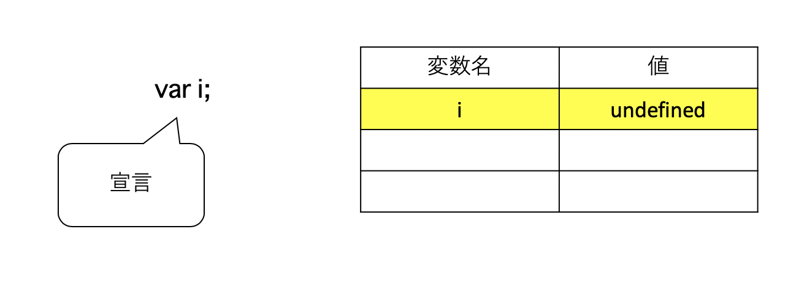
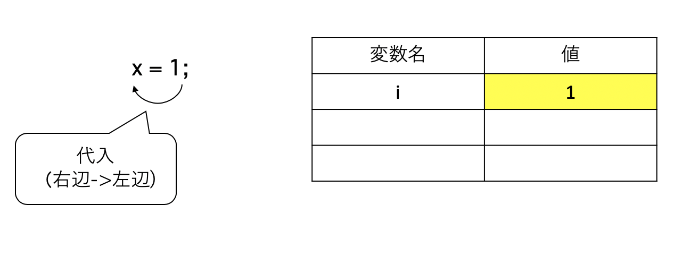
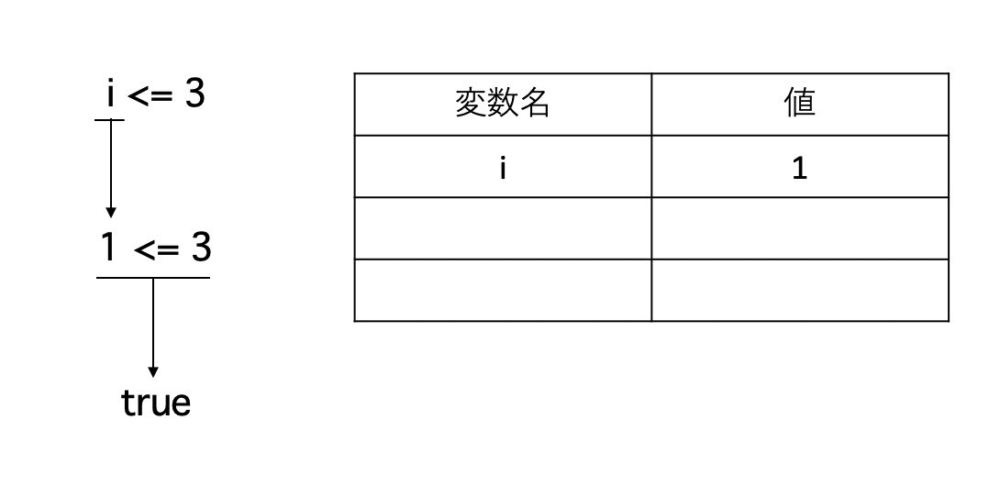
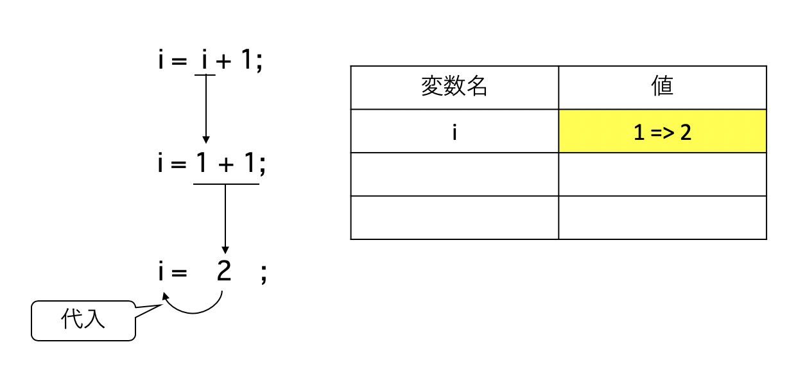
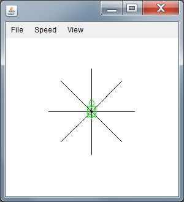
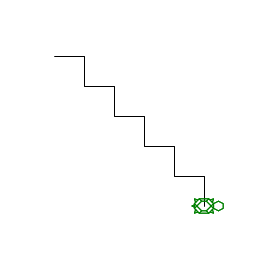

# コンピュータの得意な仕事(繰り返し)

## 学習目標
- 繰り返しのあるプログラムの実行順序を理解し，応用してプログラムが書けるようになる

## 繰り返し
今回のテーマは同じ命令を何度も書かずに，コンピュータに繰り返しさせることです．

繰り返しプログラムを見ていく前に，何を繰り返すか考えていきましょう．

### 何を繰り返すのか
何回も出てきた，家のプログラムを見てみましょう．

<span class="CopyButton" onclick="copycode('lst:4-1')">c</span>

```{#lst:4-1 .javascript .numberLines caption="House"}
var t = createTurtle();
// 屋根を書く
t.rt(30);
t.fd(50);
t.rt(120);
t.fd(50);
t.rt(120);
t.fd(50);
t.rt(120);
t.lt(30);


// 本体を書く
t.rt(90);
t.fd(50);
t.rt(90);
t.fd(50);
t.rt(90);
t.fd(50);
t.rt(90);
t.fd(50);

```

このプログラム，何度も同じことを書いている個所が2箇所ありますね．どこが同じか考えてみましょう．

### 繰り返しを使ったプログラム
繰り返しを使って，すっきりとしたプログラムにしてみましょう．

<!-- リスト 5.2.2.1 WhileHouse.java -->
<span class="CopyButton" onclick="copycode('lst:4-2')">c</span>

```{#lst:4-2 .javascript .numberLines caption="House"}
var t = createTurtle();

// 屋根を書く
t.rt(30);
var i = 1;
while (i <= 3) {
  t.fd(50);
  t.rt(120);
  i = i + 1;
}
t.lt(30);// 上向きに戻す

// 本体を書く
var i = 1;
while (i <= 4) {
  t.rt(90);
  t.fd(50);
  i = i + 1;
}
```

今回登場した「繰り返し」を使うと，プログラムを繰り返すことができます．

繰り返しの一般的な形は次のとおりです．

```
while( [条件式] ) {
	処理
}
```

条件式は前回の条件分岐によるプログラムで学習した書式と同じ書式が使えます．

条件式が成立(true)のした場合には，処理が実行されます．不成立(false)の場合は処理を飛ばします．処理が実行し終わると，もう一度条件式を評価します．これを，条件式が不成立(false)になるまで繰り返します．

これをフローチャートを用いて書くと，次のようになります．

#### 繰り返しのフローチャート


繰り返しを止めるために，変数を使います．この変数には，「今何回繰り返したか」といった情報を格納しておきます．

#### プログラムのフローチャート


### 繰り返しを使ったプログラムの実行過程
プログラムの実行過程と変数の値の変化を見ていきましょう．

1. 変数の宣言
<div class="CJPicture">

</div>

2. 変数を初期化する(1を代入)
<div class="CJPicture">

</div>

3. 変数を評価して条件を判定する
<div class="CJPicture">

</div>

4. 変数に1を加える
<div class="CJPicture">

</div>

変数が，5になったときに条件式が不成立(false)になるので，繰り返しが終ります． これで4回繰り返されるのが分かるでしょうか？

<!-- ## コラム：while()の後に;はつけないで!{.unnumbered} -->

## 応用：円を書くプログラム
繰り返しを使うと，円を簡単に書くことができます．次のプログラムを実行してみましょう．

### 円を書きつづけるプログラム
<!-- リスト 5.3.1.1 Circle.java -->
<span class="CopyButton" onclick="copycode('lst:4-3')">c</span>

```{#lst:4-3 .javascript .numberLines caption="Circle"}
var t = createTurtle();

// 円を書く
while (true) {
  t.fd(1);
  t.rt(1);
}

```

### 円を描くプログラムの改良
上記の円を描くプログラムは，条件が無い(常に成立(true))ので止まりません．
変数をつけ，適切な条件式を考えて，一周したらプログラムを止めるように改良しましょう．

<span class="CopyButton" onclick="copycode('lst:4-4')">c</span>

```{#lst:4-4 .javascript .numberLines caption="Circle"}
var t = createTurtle();

// 円を書く
var i = 1; //繰り返しをカウントする変数
while (i <= 360 /* 条件--iが360以下の間 */ ) {
  t.fd(1);
  t.rt(1);
  i = i + 1; //繰り返しカウントを一つ増やす
}
```

## for文
繰り返しの基本はwhile文を使った繰り返しですが，指定した回数繰り返すというのはよくあるパターンで，その場合には，
1. 繰り返しをカウントする変数を作る
1. while文の条件の間
1. 繰り返しの処理をする
1. 繰り返しカウントを一つ増やす
という，処理パターンを記述することになります．
この処理パターンはよく書くので，簡略化して書ける構文（糖衣構文）である「for文」が用意されています．

for文を使うと，while文よりも短く書くことができます．

<span class="CopyButton" onclick="copycode('lst:4-5')">c</span>

```{#lst:4-5 .javascript .numberLines caption="Circle"}
var t = createTurtle();

// 円を書く
for (var i = 1; i <= 360; i = i + 1) {
  t.fd(1);
  t.rt(1);
}
```

for文の一般型は以下の形です．
```
for([初期処理] ;[条件式] ;[一回の繰返しの終了処理] ) {
	[繰り返す処理]
}
```
<!-- for文の()の中の命令は，それぞれwhile文と以下のように対応しています．

 -->

さらに，変数に１を加える，というのもよく行われる処理なので，糖衣構文が用意されています．
`i = i + 1` は `i++` と書くことができます．

したがって，円を書くプログラムは次のように書けます．

<span class="CopyButton" onclick="copycode('lst:4-6')">c</span>

```{#lst:4-6 .javascript .numberLines caption="Circle"}
var t = createTurtle();

// 円を書く
for (var i = 1; i <= 360; i++) {
  t.fd(1);
  t.rt(1);
}
```

## コラム：カウントは0から？1から?{.unnumbered}
先程のプログラムでは，iを1からカウントして，360以内の時，つまり，361になった時にループから抜けて，プログラムを止めていました．
以下のように，iを0からカウントして，360より小さい，つまり360になった時にループから抜けて，プログラムを止めても同じことができます．

<span class="CopyButton" onclick="copycode('lst:4-7')">c</span>

```{#lst:4-7 .javascript .numberLines caption="Circle"}
var t = createTurtle();

// 円を書く
for (var i = 0; i < 360; i++) {
  t.fd(1);
  t.rt(1);
}
```

## 練習問題 
<!-- ### 円を描くプログラムを改良しよう
最後に出てきた円を描くプログラムは，条件が無い(常に成立(true))ので止まりません． 変数をつけ，適切な条件式を考えて，一周したらプログラムを止めるように改良して下さい．

ファイル名は「Circle.java」とすること． -->

### while文からfor文への書き換え
「4.2.2 家を描くプログラム（while文書き換え版）」をfor文に書き換えてください．

ファイル名は「housefor.js」とすること．

### 円の描かれ方についての考察
一回の繰り返しで動く大きさ(fd(1))と，角度(rt(1))の数字を変更すと，円の大きさを変えることができます． いろいろ数字を変えて，どのようにすると自分の思った円がかけるか，考察してください．

ヒント: 大きさと角度を入力できるようにすると，大きさや角度を変える時にプログラムを書き換える必要がないので，実験しやすくなります．

### 四角形を描くプログラム（繰り返しを使って）
四角形を描くプログラムを繰り返しを使って書き直してください．

ファイル名は「box.js」とすること．

### 五角形を描くプログラム（繰り返しを使って）
五角形を描くプログラムを繰り返しを使って書き直してください．

ファイル名は「pentagon3.js」とすること．

### 星を描くプログラム（繰り返しを使って）
星を描くプログラムを繰り返しを使って書き直してください．

ファイル名は「star3.js」とすること．

### アスタリスクを描くプログラム（繰り返しを使って）
アスタリスクを描くプログラムを繰り返しを使って書いてください．



ファイル名は「asterisk.js」とすること．

### 階段を描くプログラム
ユーザーの入力を受け取り(input命令を使う)，入力された数をNとして，N段の階段（下図は，N=5の例）
を描くプログラムを作ってください．



ファイル名は「stair.js」とすること．

### 正N角形を描くプログラム
ユーザーの入力を受け取り，入力された数をNとして，正N角形を描くプログラムを作ってください．

ファイル名は「regularpolygon.js」とすること．

### 繰り返しを使った作品制作
10回以上の繰り返しを含む，作品を作ってください．

ファイル名は「myrepeat.js」とすること．

