# ブロックの入れ子構造

## 学習目標
- 繰り返しや分岐を入れ子にして，目的のプログラムが書けるようになる
- 剰余演算子を使って，一定の周期をもつプログラムが書けるようになる

## 繰り返しの入れ子
今回は繰り返しの入れ子（繰り返しの中に繰り返しがあること）に挑戦してみましょう．

### 窓を描く（４つの四角形を描く）プログラム
次のプログラムを見てみましょう．

<!-- リスト 6.2.1.1 FourSquares.java -->
```{#lst:4-1 .javascript .numberLines caption="House"}
var t = createTurtle();

{ // 窓を描く
  for (var j = 1; j <= 4; j++) { 
    for (var i = 1; i <= 4; i++) {// 四角形を描く
      t.fd(50);
      t.rt(90);
    }
    t.rt(90);
  }
}
```

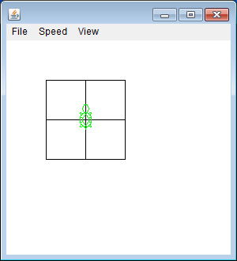

前回，四角形を描くには繰り返しを使うことを習いました．今回は，さらにその四角形を何個も描くために， もう一つ外側に繰り返しを作って，"繰り返しを繰り返す"ということをやっています．

入れ子の様子はフローチャートで示すとよく分かります．

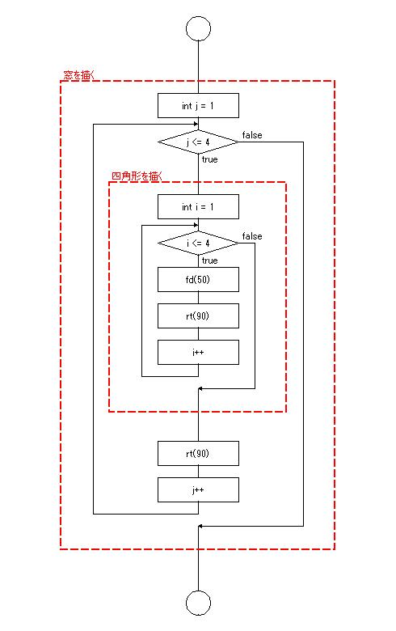

### ブロックの入れ子
ブロックは中括弧({})で囲まれた部分のことを言います．

下図のように，プログラムのifブロックやwhileブロック, forブロックなどはいくつでも入れ子にすることができます．

<div class="CJPicture">
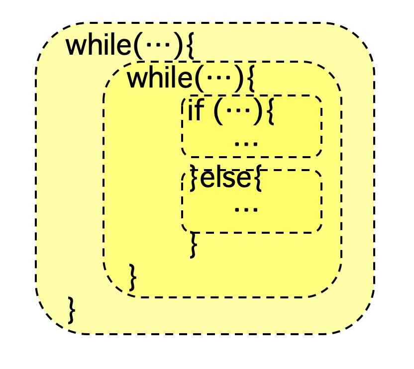
</div>

<!-- ### コンパイルエラーに注意{.nunumbered}
ブロックを示す中括弧は必ず対応していなくてはなりません． 開き括弧が余ったり，閉じ括弧が余ったりすると，コンパイルエラーとなります． 
括弧違いの場合，コンピュータはブロックを勘違いしてしまうので， よけいなコンパイルエラーが（たくさん）でます． たくさんのコンパイルエラーが一気にでたら，まず括弧の対応関係を確かめましょう．-->

### カッコの対応エラーに注意{.unnumbered}
ブロックを示す中括弧は開きカッコと閉じカッコが必ず対応していなくてはなりません．
開き括弧が余ったり，閉じ括弧が余ったりすると，構文エラーとなります．


### インデント
第3回の時にも指摘しましたが，インデントをつけると括弧の対応関係やブロックの範囲が分かりやすくなります．
インデントがついていないソースは受理しません．
見やすいだけでなく，これができていないために構文エラーで動かない場合が非常に多いので， 注意してください．

<div class="CJPictureS">
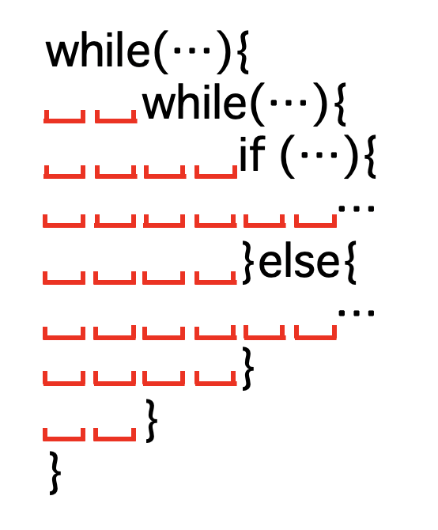
</div>

PikePlace環境では，[Ctrl-s](Ctrlキーを押しながらsキーを押す)で，フォーマット（自動的に字下げをすること）ができます．

## 入れ子と並列の違いの考察：花を描くプログラム
入れ子の応用として，花を描くプログラムを考えてみましょう．

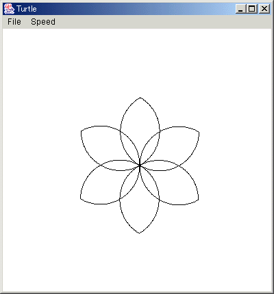

### 花びらを描く
花を描くには，まず花びらをかいて，それを繰り返す必要があります．

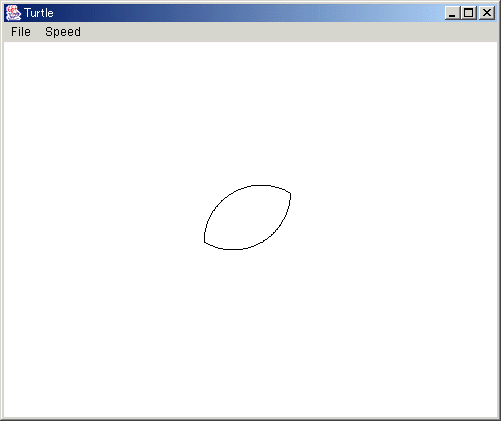

<!-- リスト 6.3.1.1 Petal.java -->
```{#lst:4-1 .javascript .numberLines caption="House"}
var t = createTurtle();

{ // 花びらを描く
  for (var i = 1; i <= 120; i++) { // 円弧を描く
    t.rt(1);
    t.fd(1);
  }

  // 次の円弧の角度へ
  t.rt(60);

  for (var i = 1; i <= 120; i++) { // 円弧を描く
    t.rt(1);
    t.fd(1);
  }
}
```

### 花を描く
花びらを描くには繰り返しが必要で，花を描くにはさらにそれを繰り返す必要があります． 以下のように，繰り返しの入れ子を使います．

<!-- リスト 6.3.2.1 Flower.java -->
```{#lst:4-1 .javascript .numberLines caption="House"}
var t = createTurtle();

{ // 花をかく（6枚の花びらを書く）
  for (var j = 1; j <= 6; j++) {
    { // 花びらを描く
      for (var i = 1; i <= 120; i++) { // 円弧を描く
        t.rt(1);
        t.fd(1);
      }

      // 次の円弧の角度へ
      t.rt(60);

      for (var i = 1; i <= 120; i++) { // 円弧を描く
        t.rt(1);
        t.fd(1);
      }
    }
  }
}
```
 
ポイントは，花びらを書くループの外側にそれを6回繰り返すループをつくる （つまりループを入れ子にする）ことです． 「繰り返しを繰り返す」ためには，繰り返す繰り返しの外側に繰り返しループ を書く必要がありました．構造は以下のようになります．

<div class="CJPicture">
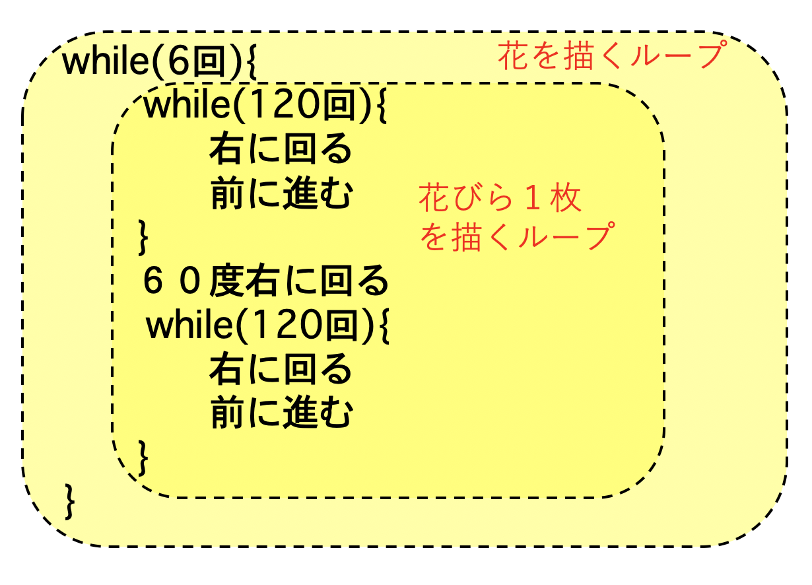
</div>

### 花を描く（間違い）
以下に，よくある間違いの例を示します．

<!-- リスト 6.3.3.1 BadFlower.java -->
```{#lst:4-1 .javascript .numberLines caption="House"}
var t = createTurtle();

{ // 花をかく（6枚の花びらを書く）
  for (var j = 1; j <= 6; j++) {
    t.rt(1);
    t.fd(1);
  }
}

{ // 花びらを描く
  for (var i = 1; i <= 120; i++) { // 円弧を描く
    t.rt(1);
    t.fd(1);
  }

  // 次の円弧の角度へ
  t.rt(60);

  for (var i = 1; i <= 120; i++) { // 円弧を描く
    t.rt(1);
    t.fd(1);
  }
}
```

これがうまくいかない理由が説明できるでしょうか？ 以下に，このプログラムの構造を示しますので， うまくいく方と比較してみましょう．

<div class="CJPicture">
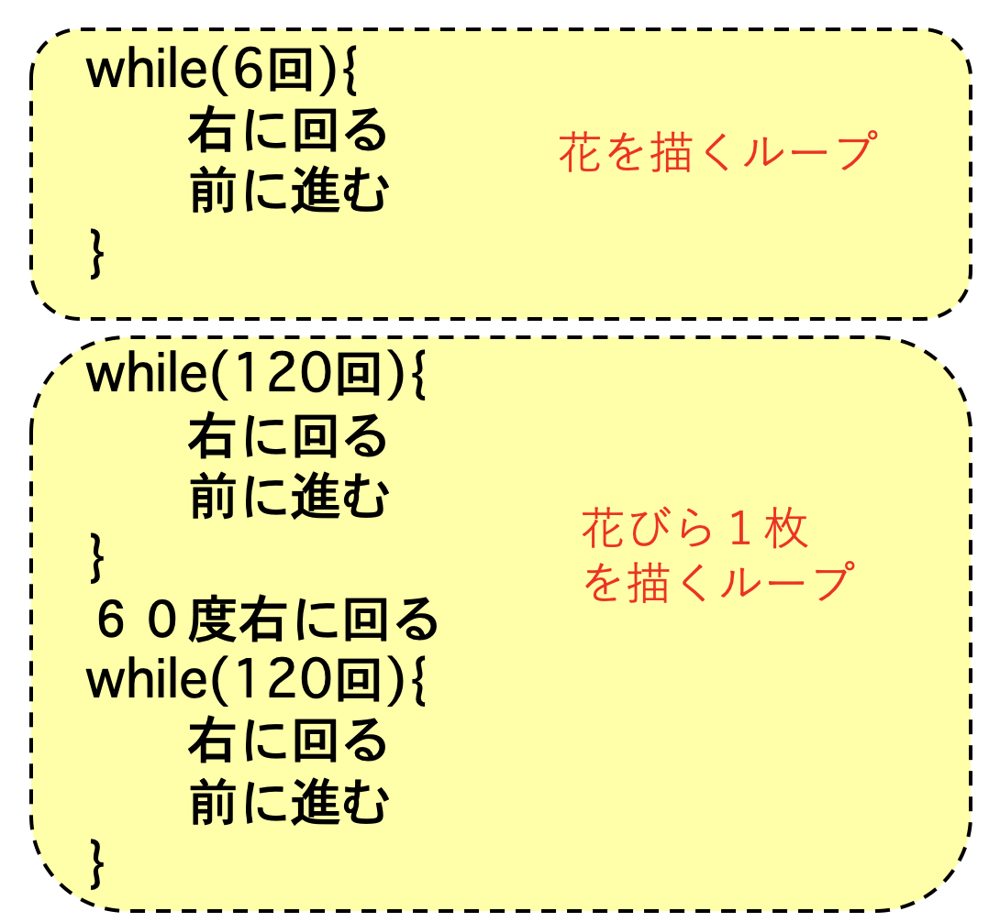
</div>

このように，入れ子を作る時には，｛｝の位置に注意する必要があります．

## 繰り返し変数の利用
### 目玉を描くプログラム
次のプログラムを見てみましょう．

<!-- リスト 6.4.1.1 MultiCircle.java -->
```{#lst:4-1 .javascript .numberLines caption="MultiCircle"}
var t = createTurtle();

for (var j = 1; j <= 10; j++) { // （円を）10個描く

  { // 円を描く
    var i = 1;
    while (i <= 360) {
      t.fd(1);
      t.rt(j);
      i = i + j;
    }
  }
}
```

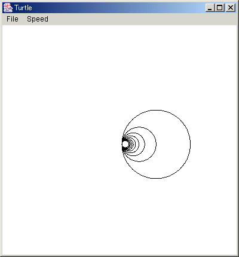

「「円を描く繰り返し」を繰り返す」という入れ子のループになっています．ただし，単に10回円を描くのではなく， j回目のループの時にj度だけ回りながら円を作っています．つまり，繰り返しの回数を記憶しておくjという変数を利用して， 繰り返しの回数で円の大きさを変化させようとしているのです．

### 奇数と偶数を判定する
剰余演算子(%)を使うと，割り算のあまりを求めることができます． これを使うと，例えば奇数と偶数を判定することができます．

<!-- リスト 6.4.2.1 SquareAndTriangle.java -->
```{#lst:4-1 .javascript .numberLines caption="House"}
var t = createTurtle();
var length = 50; // １辺の長さ

for (var i = 1; i <= 8; i++) { // 図形を描く（8回繰り返す）

  if (i % 2 == 0) { // 偶数なら
    for (var j = 1; j <= 4; j++) { // 四角形を書く
      t.fd(length);
      t.lt(90);
    }
  } else { // 奇数なら
    for (var j = 1; j <= 3; j++) { // 三角形を書く
      t.fd(length);
      t.lt(120);
    }
  }

  { // 次の図形を書く位置に移動する
    t.up();
    t.rt(135);
    t.fd(length);
    t.rt(180);
    t.down();
  }
}
```

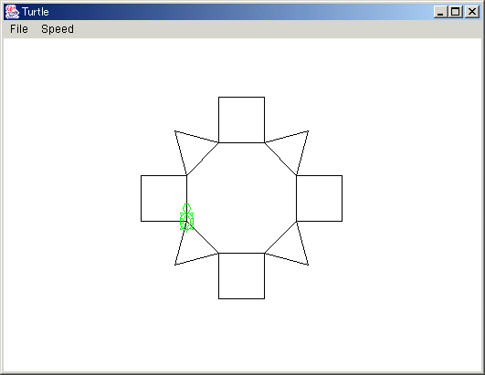

このプログラムでは，剰余演算子と，先ほど説明した繰り返しの変数を利用して， 繰り返した数が偶数なら四角，奇数なら三角を描くようにプログラムされています．

## 練習問題
### 四角形を10個描くプログラム


ファイル名は「tenboxes.js」とすること．

### 四角形を100個描くプログラム

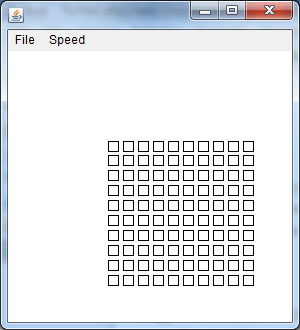

ファイル名は「hundredboxes.js」とすること．

### 四角形と三角形を交互に100個描くプログラム


ファイル名は「hundredboxes2.js」とすること．

### 貝殻を描くプログラム

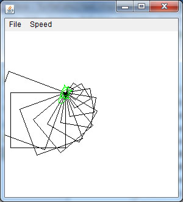

ヒント１：まず以下のプログラムを作ってみよう．

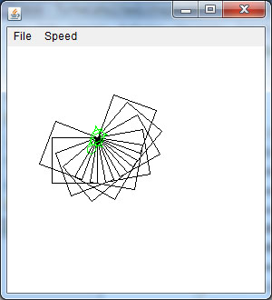

ヒント２：ヒント１が出来たら，四角の大きさを指定するとき，上位ループの繰返しの変数を利用する．

ファイル名は「shell.js」とすること．

### タイヤを描くプログラム

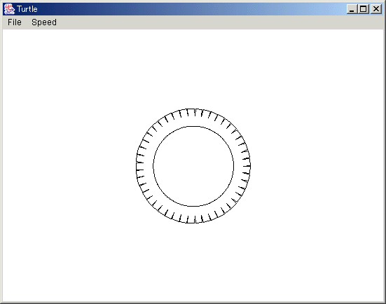

ヒント：ずらす角度は8度, 四角の１辺は10歩にするとうまくいく． 真ん中の円は多少ずれていても構わない．

ファイル名は「tire.js」とすること．

### ドラえもんを描くプログラム

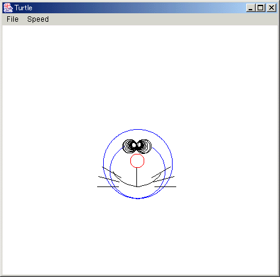

ファイル名は「doraemon.js」とすること．

### キーボードを描くプログラム

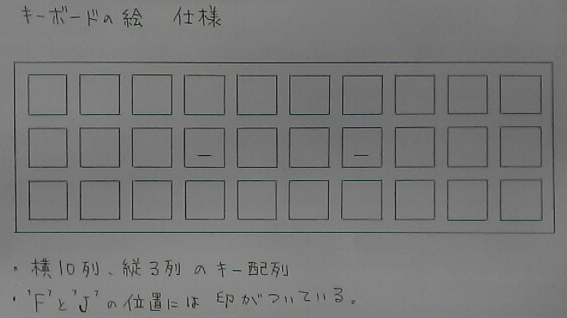

ファイル名は「keyboard.js」とすること．

