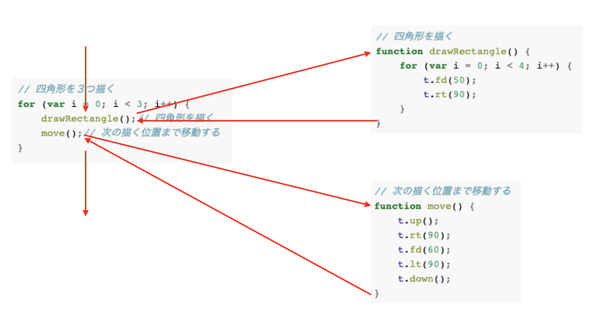
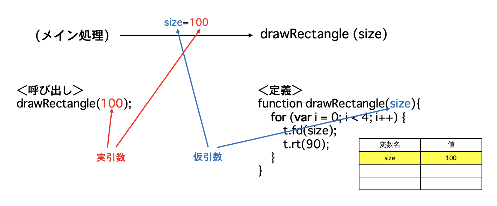
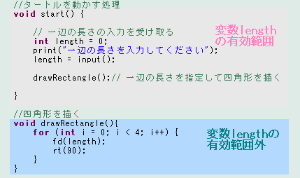
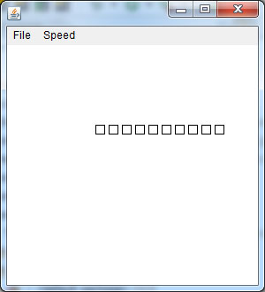
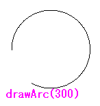
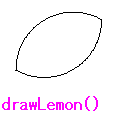
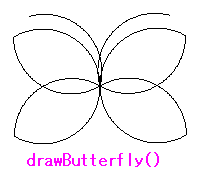
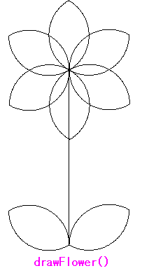
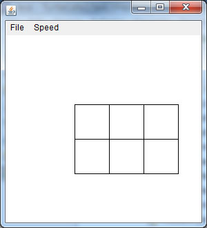
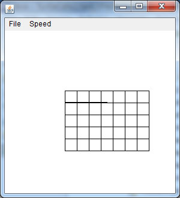

# 命令をつくる（１）：関数．引数付関数

## 学習目標
- 関数を使ったプログラムを作れるようになる
- 引数付関数を使ったプログラムを作れるようになる

## 関数
### 関数とその目的

関数は，複数の命令のまとまりに名前をつけて，一つの命令として扱うことが出来る仕組みです．

関数を作ることで，

- プログラムを構造化して，全体の複雑度を下げる（人間にとって理解しやすいプログラムにする）
- プログラムを再利用しやすくする

というメリットがあります．

### 関数定義と関数呼び出し
以下のプログラムは，関数を使って四角形を描くプログラムです．

<!-- リスト 12.2.2.1 DrawRectangleMethod.js -->
<span class="CopyButton" onclick="copycode('lst:6-1')">c</span>

```{#lst:6-1 .javascript .numberLines caption="DrawRectangleMethod"}
var t = createTurtle();
drawRectangle();

// 四角形を描く
function drawRectangle() {
    for (var i = 0; i < 4; i++) {
        t.fd(50);
        t.rt(90);
    }
}
```

関数を使うためには，関数を定義し，その関数を呼び出す必要があります．

関数は一度定義すれば，同じ関数を何度も呼び出して使うことができます．

このプログラムでは5行目から10行目で関数を定義し，2行目でそれを呼び出しています．
				
引数．戻り値なしの関数定義，関数呼び出しの一般形は以下の通りです

```
function [関数名](){

}
```

```				
[関数名]();
```

### 関数の処理の順序
以下のプログラムは，四角形を描く関数を使って，四角形を３つ描くプログラムです．

<!-- リスト 12.2.3.1 DrawThreeRectanglesMethod.js -->
<span class="CopyButton" onclick="copycode('lst:6-2')">c</span>

```{#lst:6-2 .javascript .numberLines caption="House"}
var t = createTurtle();

// 四角形を３つ描く
for (var i = 0; i < 3; i++) {
    drawRectangle();// 四角形を描く
    move();// 次の描く位置まで移動する
}


// 四角形を描く
function drawRectangle() {
    for (var i = 0; i < 4; i++) {
        t.fd(50);
        t.rt(90);
    }
}

// 次の描く位置まで移動する
function move() {
    t.up();
    t.rt(90);
    t.fd(60);
    t.lt(90);
    t.down();
}
```

関数が呼び出されると，プログラムの処理はその関数の処理に飛びます． そして，関数が終了すると，関数呼び出し位置に返ってきます．

<div class="CJPictureL">

</div>

四角形を３つ描くプログラムでは，まず，四角形を描く関数を呼び， 四角形を描き終わったら，次の描く位置まで移動する関数を呼び， 移動し終わったら，再び四角形を描く関数を呼び…という処理を３回繰り返しています．

<!-- ### 関数の定義位置の注意点
次のプログラムは，四角形を描くプログラムを書こうとして，失敗した例です．

リスト 12.2.4.1 DrawRectangleMethodError.js

このプログラムを実行しようとすると，以下のようなエラーが出ます．

DrawRectangleMethodError.js:22: 式の開始が不正です．
		void drawRectangle(){
		^
DrawRectangleMethodError.js:22: ';' がありません．
		void drawRectangle(){
		                  ^
エラー 2 個 
					
これは，関数の中に関数を定義しているためです． このプログラムでは，start関数の中に，drawRectangle関数を定義しています．

図 12.2.4.1 関数定義のミス
Javaでは，関数の中に関数を定義することはできません．（ 2章「プログラムの要素」参照 ） 関数は，クラスブロックの中に書く必要があります． 正しい関数定義は以下のとおりです．

図 12.2.4.2 正しい関数定義

-->

## 引数付関数
### 引数とその目的
関数ブロック内で宣言された変数は，関数ブロック内でしか有効ではありません． しかし，ある関数から他の関数を呼ぶときに，データを受け渡したいことがあります． 引数とは，関数ブロック外と，関数ブロック内でデータをやり取りする仕組みです． 引数を使うことで，関数ブロック外から，関数ブロック内にデータを受け取ることができます．

### 引数を用いた，四角形を描く関数の抽象化
引数が使えない場合，次のように大きさが違う四角形を書きたい場合も， 2つの関数を作る必要があります．

<div class="CJPicture">

</div>

<!-- リスト 12.3.2.1 DrawTwoRectangles1.js -->
<span class="CopyButton" onclick="copycode('lst:6-3')">c</span>

```{#lst:6-3 .javascript .numberLines caption="House"}
var t = createTurtle();

drawBigRectangle();
drawSmallRectangle();

// 一辺100の大きな四角形を書く
function drawBigRectangle() {
    for (var i = 0; i < 4; i++) {
        t.fd(100);
        t.rt(90);
    }
}

// 一辺20の小さな四角形を書く
function drawSmallRectangle() {
    for (var i = 0; i < 4; i++) {
        t.fd(20);
        t.rt(90);
    }
}
```

次のプログラムでは，引数を使って大きさを指定し，大きい四角形と小さな四角形を「四角形を描く」という ひとつの関数で描けるようにしています．

<div class="CJPicture">

</div>

<!-- リスト 12.3.2.2 DrawTwoRectangles2.js -->
<span class="CopyButton" onclick="copycode('lst:6-4')">c</span>

```{#lst:6-4 .javascript .numberLines caption="House"}
var t = createTurtle();

drawRectangle(100);
drawRectangle(20);

// 一辺がsizeの四角形を書く
function drawRectangle(size) {
    for (var i = 0; i < 4; i++) {
        t.fd(size);
        t.rt(90);
    }
}
```

引数付関数を使うためには，引数付関数を定義し，その関数を引数付で呼び出します． 一般形は以下の通りです．

```					
function [関数名]([仮引数名]){

}
```

```				
[関数名]([実引数]);
```

呼び出し部分の引数を実引数，宣言部分の引数を仮引数と呼びます．実引数（関数ブロック外にあるデータ）が， 仮引数（関数ブロック内で使える変数）に代入され，関数ブロック内でその変数の値が使えるようになります．

<div class="CJPictureL">

</div>

### 引数を用いた，多角形を描く関数の抽象化
家を書くプログラムでは，三角形と四角形を書くために， 2つの関数を作る必要があります．

<div class="CJPicture">

</div>

<!-- リスト 12.3.3.1 NewHouse1.js -->
<span class="CopyButton" onclick="copycode('lst:6-5')">c</span>

```{#lst:6-5 .javascript .numberLines caption="House"}
var t = createTurtle();

drawTriangle(100);
t.rt(90);
drawRectangle(100);

// 三角形を書く
function drawTriangle(size) {
    t.rt(30);
    for (var i = 0; i < 3; i++) {
        t.fd(size);
        t.rt(120);
    }
    t.lt(30);
}

// 四角形を書く
function drawRectangle(size) {
    for (var i = 0; i < 4; i++) {
        t.fd(size);
        t.rt(90);
    }
}
```

次のプログラムでは「屋根を描く」処理で使っていた三角形と，「壁を描く」処理で使っていた四角形を 「多角形を描く」というひとつの関数で描けるようにしています．

<div class="CJPicture">

</div>

<!-- リスト 12.3.3.2 NewHouse2.js -->
<span class="CopyButton" onclick="copycode('lst:6-6')">c</span>

```{#lst:6-6 .javascript .numberLines caption="House"}
var t = createTurtle();

drawRegularPolygon(3, 100);
t.rt(90);
drawRegularPolygon(4, 100);


// 指定された角数の正多角形を描く
function drawRegularPolygon(n, size) {
    // 向きを調節する
    var angle = 360 / n;
    t.rt(angle - 90);

    // 多角形を描く
    for (var i = 0; i < n; i++) {
        t.fd(size);
        t.rt(angle);
    }

    // 向きを上向きに戻す
    t.lt(angle - 90);
}
```
 
## 変数の有効範囲と引数
### 変数の有効範囲
次のプログラムは，一辺の長さを指定して四角形を描くプログラムを書こうとして，失敗した例です．

<span class="CopyButton" onclick="copycode('lst:6-7')">c</span>

```{#lst:6-7 .javascript .numberLines caption="ScopeError"}
var t = createTurtle();

start();

function start(){
    var length = input('一辺の長さ？');
    drawRectangle();
}

function drawRectangle(){
    for(var i=0;i<4;i++){
        t.fd(length);
        t.rt(90);
    }
}
```

上記のプログラムを実行しても，入力した大きさの四角形が描かれず，大きさ0の四角形が描かれます．
					
これは，t.fd(length)のlengthという変数が参照できず，0と置き換えられてしまうための動作です．lengthという変数が参照できないのは，drawRectangle()関数の内部（{と}で囲われた部分）が，lengthという変数の有効範囲外であるためです．

<!--  -->

### 引数付関数定義と関数呼び出し
以下のプログラムは，引数を使って，関数の有効範囲外から四角形の長さを渡せるようにしたプログラムです．

入力された長さのlength（実引数）を，関数にlength（仮引数）として渡し，四角形を描いています．

<span class="CopyButton" onclick="copycode('lst:6-8')">c</span>

```{#lst:6-8 .javascript .numberLines caption="House"}
var t = createTurtle();

start();

function start(){
    var length = input('一辺の長さ？');
    drawRectangle(length);
}

function drawRectangle(length){
    for(var i=0;i<4;i++){
        t.fd(length);
        t.rt(90);
    }
}

```

<!-- ```					
29: void drawRectangle(int length){
30: 	for (int i =0; i < 4; i++) {
31: 		fd(length);
32: 		rt(90);
33: 	}
34: }
```	

```					
24: drawRectangle(inputLength);//入力された長さを一辺の長さとして四角形を描く
```	 -->
				
## 関数の設計．あるいはプログラムの構造化
関数から関数を呼ぶことが出来るため，関数の連鎖を用いてプログラムを作ることができます． これは「構造化プログラミング」という，複雑さを制御するための基本的設計技法です．

複雑になると，関数の呼び出し関係が混乱してくるので，まず以下のような関数構成図を書き， プログラムを書いていくと良いでしょう．

<div class="CJPictureL">

</div>

この設計を実装したものを下に載せます．

### 窓付きの家を描くプログラム（引数を用いた，多角形を描く関数の抽象化）
<!-- リスト 12.5.1.1 House05.js -->
<span class="CopyButton" onclick="copycode('lst:6-9')">c</span>

```{#lst:6-9 .javascript .numberLines caption="House"}
var t = createTurtle();

// 家を描く
//タートルを動かす処理
drawRoof(); // 屋根を描く
drawWall(); // 壁を描く
drawWindow(); // 窓を描く

// 屋根を描く
function drawRoof() {
    drawRegularPolygon(3, 80); // 三角形を描く
}

// 壁を描く
function drawWall() {
    t.rt(90); // 向きを調節する
    drawRegularPolygon(4, 80);// 四角形を描く
    t.lt(90);// 向きを上向きに戻す
}

// 窓を描く
function drawWindow() {
    // 窓を描く位置まで移動する
    moveToWindowLocation(22);

    // 窓を描く
    t.rt(90);
    for (var i = 0; i < 4; i++) {
        drawRegularPolygon(4, 16);
        t.fd(16 * 2 + 4);
        t.rt(90);
    }
    t.lt(90);
}

// 指定された角数の正多角形を描く
function drawRegularPolygon(n, size) {
    // 向きを調節する
    var angle = 360 / n;
    t.rt(angle - 90);

    // 多角形を描く
    for (var i = 0; i < n; i++) {
        t.fd(size);
        t.rt(angle);
    }

    // 向きを上向きに戻す
    t.lt(angle - 90);
}

// 窓を描く位置まで移動する
function moveToWindowLocation(length) {
    moveTurtle(90, 22);// 右へ
    moveTurtle(180, 22);// 下へ
}

// 指定された方向に（ペンを上げて）移動する
function moveTurtle(direction, distance) {
    t.up();
    t.rt(direction);
    t.fd(distance);
    t.lt(direction);
    t.down();
}
```

## コラム：ライブラリ{.unnumbered}
実は今まで使っていたfd，rtという命令は，以下のような関数として定義されていたのでした．

- `function fd(length){...省略...}`
- `function rt(angle){...省略...}`

ある目的のために使う関数の集まりを作り，関数群を再利用します． この関数の集まりのことを「ライブラリ」といいます． fd, rtなどのタートルに使う命令は「タートルライブラリ」としてどこかに定義されているのです．

<!-- ## コラム：亀に命令を追加する{.unnumbered}
Javascriptで関数の定義をする方法には，次のような書き方もあります．

```
var drawRectangle = function(length){
    for(var i=0;i<4;i++){
        t.fd(length);
        t.rt(90);
    }
}
```

この例では関数を定義して，drawRectangle変数に代入しています．
この書法を利用して，亀に命令を追加することができます． -->


## 練習問題
<!-- ### 円を描く関数を作ろう
円を描く関数「function drawCircle()」を作ってください． できたら，start関数から2回以上呼び出して，うまく動作するか確かめてみよう．

ファイル名は「circle2.js」とすること． -->

### 四角形を横に並べて１０個描くプログラム(関数を使って)

四角形を横に並べて１０個描くプログラム



について，四角形を描く以下の関数を定義し，これを利用することで描いてみよう．
```
function drawRectangle(length){
    for(var i=0;i<4;i++){
        t.fd(length);
        t.rt(90);
    }
}
```

ファイル名は「tenboxes2.js」とすること．

### 四角形を横に並べてN個描くプログラム(引数付関数を使って)

上の問題について，プログラム全体を関数にして引数n（四角形の個数）をとるようにし，

```
drawBoxes(10);
```
とすると，１０個の四角形を描き，

```
drawBoxes(5);
```
とすると，５個の四角形を描くプログラムを書きなさい．

ファイル名は「tenboxes3.js」とすること．

<!-- ### 四角形を100個描くプログラム
四角形を１００個を１０ｘ１０に並べて描くプログラムを作ってみよう
 -->

### 大きさが変わる家を描くプログラム
大きさを指定して家を描く関数（窓はなくて良い）「function drawHouse(size)」を作ってください． できたら，2回以上呼び出して，うまく動作するか確かめてみよう．

ファイル名は「twohouses.js」とすること．

### 中心角を指定して円弧を描くプログラム
中心角を指定して円弧を描く関数「function drawArc(angle)」を作り，テストしてください．

(ヒント：中心角が３６０ならば円に，１８０ならば半円に，１ならば点のようになります．以下に，120度の場合と，300度の場合の例を示します）




ファイル名は「drawarc.js」とすること．

### レモンを描くプログラム
drawArc(angle)を利用してレモン型の図形を描く関数「function drawLemon()」を作り，呼び出してテストをしてください．

ファイル名は「drawlemon.js」とすること．



### ちょうちょを描くプログラム（関数の多段呼び出しの練習）
蝶を描く関数drawButterfly()を作ってください．（ヒント：レモン型を描く関数drawLemon()を部品として使う）



ファイル名は「butterfly.js」とすること．

### 花を描くプログラム（関数の再利用）
drawLemon()を再利用して，drawFlower()のように花を描く関数をつくってください．



ファイル名は「flower.js」とすること．

### マス目を描くプログラム
x行y列のマス目を書く関数を作ろう．以下のような定義を持つ
					
```
function drawMasume(row, col, size) {
    ．．．なかみ．．．
}
```
				
出力例を以下に示す．

					
`drawMasume(2, 3, 50);`					
				


`drawMasume(5, 7, 20);`
				


ファイル名は「masume.js」とすること．

### 構造化プログラミングによる自由作品
「１関数１０行以内！」というルールで，図形を書くプログラムを作ろう．

ファイル名は「structured.js」とすること．

